TP noté : Pipeline DevSecOps avec GitHub Actions

Avec l’application non sécurisé nous avons l’échec des jobs :

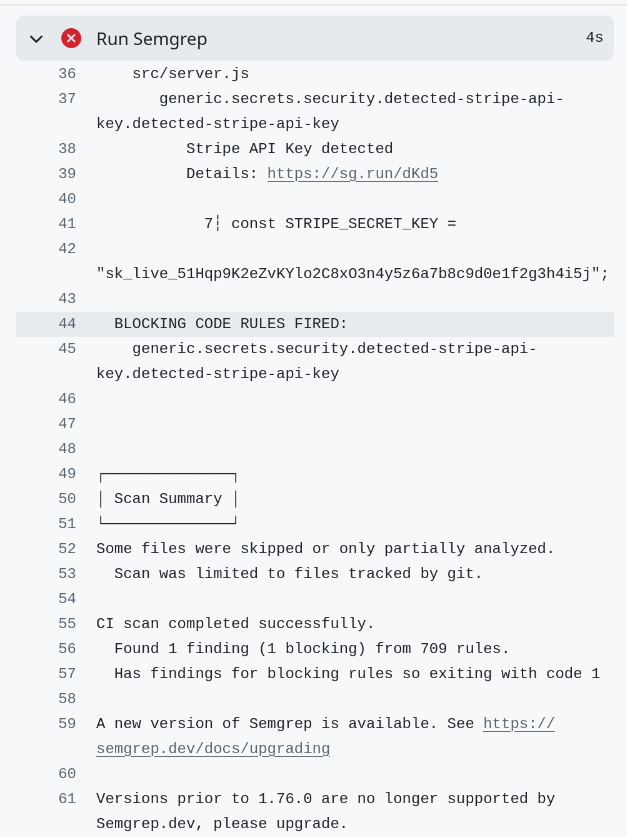

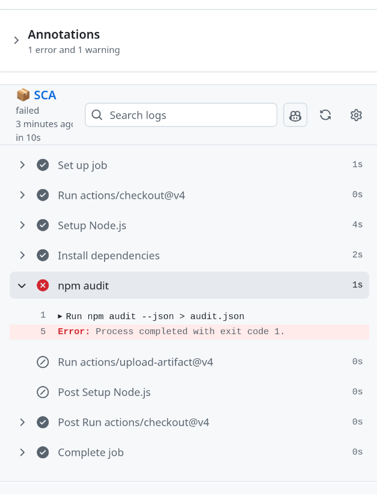
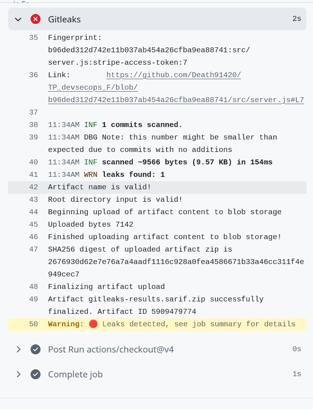

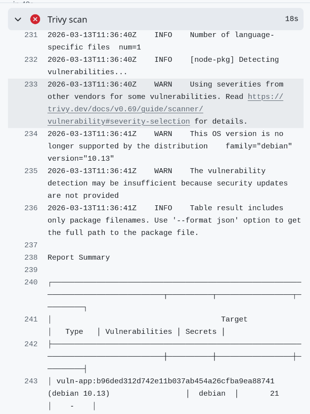

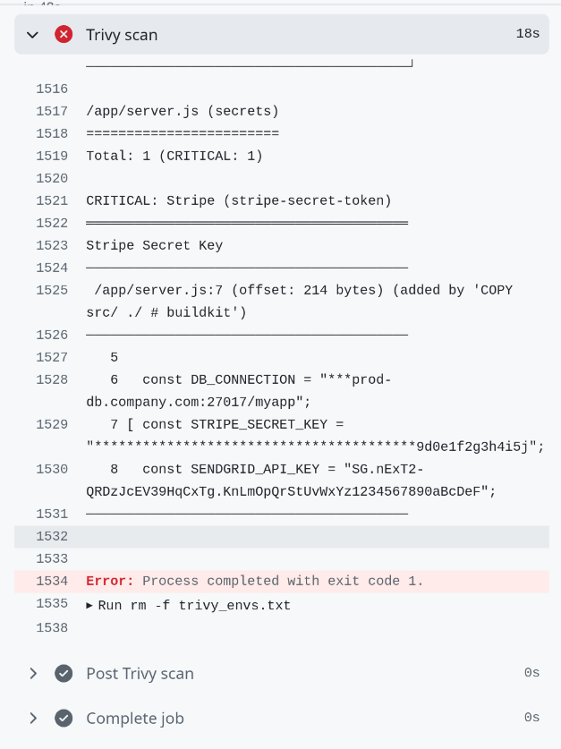

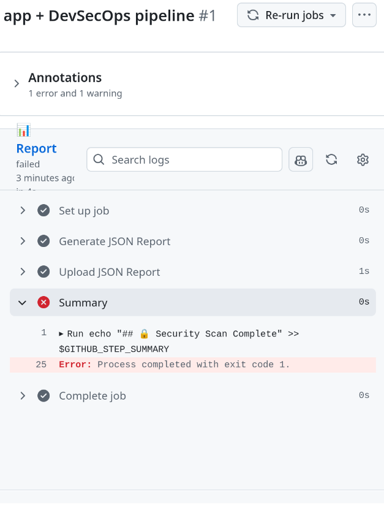

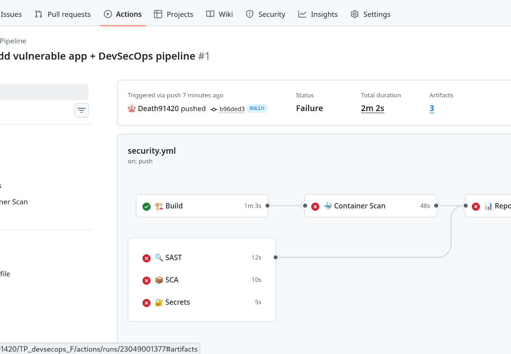

Nous avons ceci sans l’onglet security 

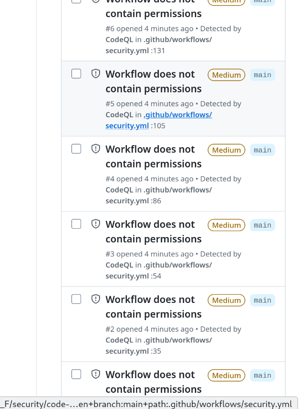

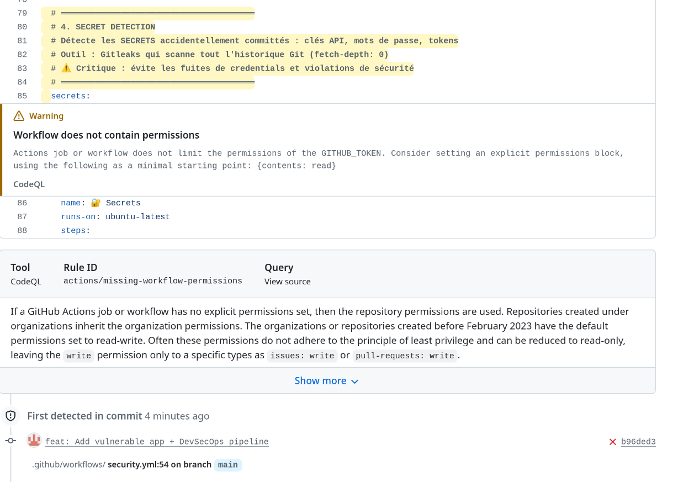

Après avoir sécurisé l’application nous avons tout nos jobs de valider 

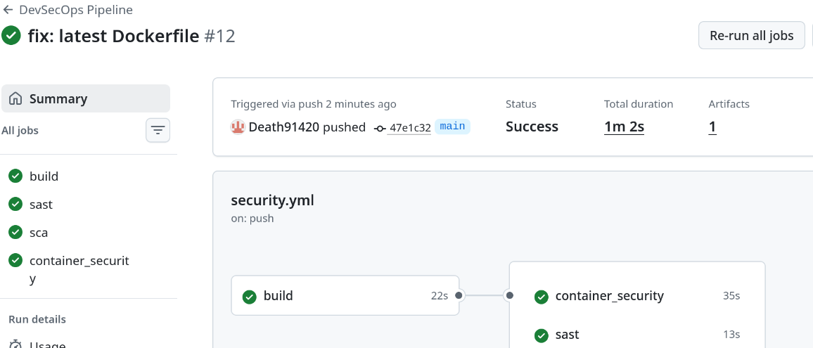

Nous avons ensuite essayer de mettre en place une injection SQL, Semgrep le détecte bien.

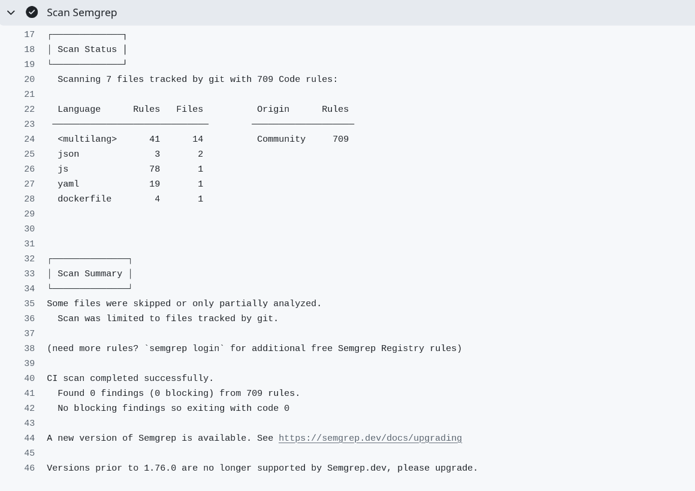
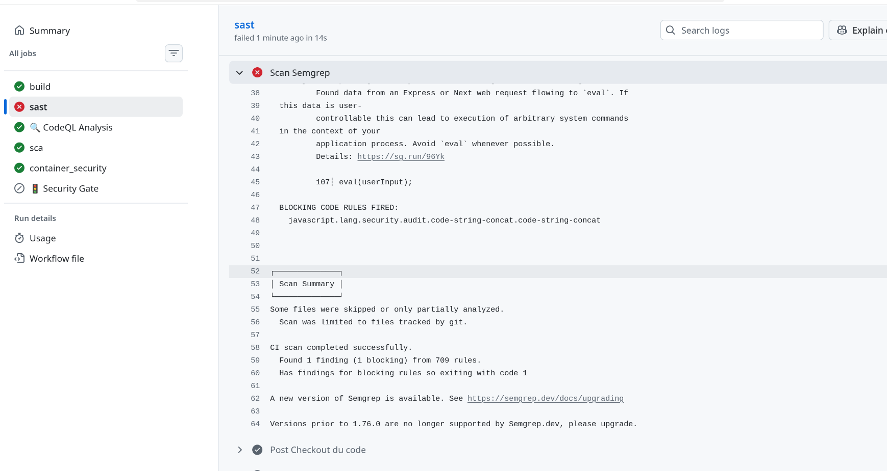